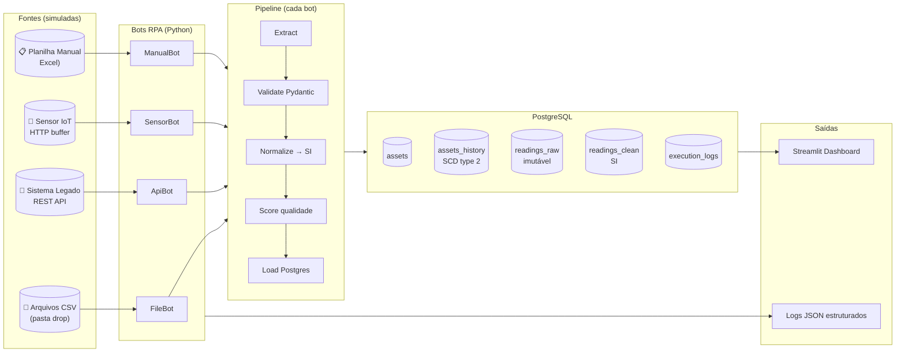

# RPA CS — Coleta, Registro e Atualização de Dados de Ativos Industriais

> **Sprint inicial** do projeto de monitoramento e manutenção preditiva de motores
> elétricos industriais. Objetivo: estabelecer o fluxo automatizado de dados que
> servirá de base para o **Digital Twin** e análises inteligentes posteriores.

---

## TL;DR — sobe tudo com 1 comando

```bash
cp .env.example .env
docker compose up --build
```

Aguarde ~30s e abra:

| Recurso              | URL                            |
|----------------------|--------------------------------|
| **Dashboard visual** | http://localhost:8501          |
| Mock API legado      | http://localhost:8001/assets   |
| Sensor IoT (HTTP)    | http://localhost:8002/readings |
| PostgreSQL           | `localhost:5432` (user `rpa`)  |

---

## O que esse projeto faz (em uma frase)

Quatro **bots RPA** rodando em container coletam dados de motores industriais a partir
de **4 fontes heterogêneas**, normalizam unidades pra SI, validam integridade,
persistem em PostgreSQL com **histórico SCD type 2**, e geram **logs auditáveis**
de cada execução — tudo orquestrado por um scheduler cron, sem intervenção humana.

---

## Arquitetura em 1 diagrama



Detalhes completos: [`docs/arquitetura.md`](docs/arquitetura.md).

---

## Mapeamento Requisito → Implementação

| Requisito do enunciado                                              | Onde está |
|---------------------------------------------------------------------|-----------|
| Coleta de dados de **diferentes fontes**                            | 4 bots em `src/bots/` (file, api, sensor, manual) |
| **Padronização e conversão** de unidades                            | `src/transform/normalizer.py` (°F→°C, kV→V, hp→kW…) |
| **Registro em base estruturada**                                    | PostgreSQL `assets` + `readings_clean` (`src/db/schema.sql`) |
| **Atualização periódica** (batch)                                   | APScheduler com cron por bot (`src/orchestrator.py`) |
| **Persistência histórica**                                          | `assets_history` (SCD type 2) + `readings_raw` (imutável) |
| **Validação e integridade**                                         | Pydantic na fronteira + `validator.py` com flags + score |
| **Logs automatizados rastreáveis**                                  | Loguru JSON + tabela `execution_logs` (run_id por execução) |
| Versionamento Git                                                   | Repositório Git (este) |
| Organização modular                                                 | `src/{bots,transform,db,models,tools}` |
| Documentação                                                        | `README.md` + `docs/` (arquitetura, fluxo, ADRs) |
| Execução reprodutível                                               | `docker compose up` — 5 serviços containerizados |
| Estrutura escalável                                                 | Ver [§ Escalabilidade](#escalabilidade-justificativa-técnica) |

---

## Stack

| Camada               | Tecnologia                  | Por quê (curto) |
|----------------------|-----------------------------|-----------------|
| Linguagem            | Python 3.12                 | ecossistema RPA mais maduro |
| Validação            | Pydantic 2                  | schema enforcement na fronteira |
| Persistência         | PostgreSQL 16               | ACID + JSONB + SCD type 2 (ver [ADR-002](docs/decisoes-tecnicas.md#adr-002)) |
| Driver               | psycopg 3                   | typed, async-ready |
| Scheduler            | APScheduler                 | cron Pythonic, in-process |
| Logging              | Loguru                      | JSON estruturado out-of-the-box |
| Mock APIs            | FastAPI + Uvicorn           | startup rápido, schema explícito |
| Dashboard            | Streamlit + Plotly          | tempo de implementação mínimo |
| Containers           | Docker + Compose            | reprodutibilidade total |
| Testes               | pytest                      | padrão da comunidade |
| Resiliência          | Tenacity                    | retry exponencial declarativo |

ADRs completos com justificativas: [`docs/decisoes-tecnicas.md`](docs/decisoes-tecnicas.md).

---

## Estrutura do repositório

```
RPA CS/
├── docker-compose.yml          ← orquestra 5 containers
├── Dockerfile                  ← imagem do orquestrador + dashboard
├── .env.example                ← variáveis de ambiente
├── requirements.txt
├── pytest.ini
│
├── src/
│   ├── main.py                 ← entrypoint (init / run / bot <nome>)
│   ├── orchestrator.py         ← APScheduler com 4 jobs cron
│   ├── config.py               ← settings via env (12-factor)
│   ├── logger.py               ← Loguru estruturado JSON
│   ├── models/asset.py         ← Pydantic: Asset, Reading, ExecutionLog
│   ├── db/
│   │   ├── schema.sql          ← DDL completo + view + trigger
│   │   ├── connection.py       ← pool com retry exponencial
│   │   └── repository.py       ← UPSERT, idempotência, SCD2
│   ├── transform/
│   │   ├── normalizer.py       ← conversão de unidades → SI
│   │   └── validator.py        ← flags + quality_score [0..1]
│   ├── bots/
│   │   ├── base.py             ← template-method (run/extract/parse)
│   │   ├── file_bot.py         ← drop folder CSV
│   │   ├── api_bot.py          ← sistema legado (REST)
│   │   ├── sensor_bot.py       ← sensor IoT (HTTP pull)
│   │   └── manual_bot.py       ← planilha Excel
│   └── tools/
│       └── gen_manual_xlsx.py  ← gera planilha de exemplo
│
├── legacy_api/                 ← FastAPI mock de sistema legado
│   ├── app.py
│   └── Dockerfile
├── sensor_simulator/           ← FastAPI mock de sensor IoT
│   ├── app.py
│   └── Dockerfile
├── dashboard/
│   └── app.py                  ← Streamlit (usa src.db.repository)
│
├── data/
│   ├── samples/                ← CSVs prontos pra demo
│   ├── drop/                   ← bot vigia esta pasta
│   ├── archive/                ← arquivos processados
│   └── manual/                 ← planilhas .xlsx
│
├── tests/
│   ├── test_normalizer.py
│   ├── test_validator.py
│   └── test_models.py
│
├── logs/                       ← rpa.log (rotacionado JSON)
└── docs/
    ├── arquitetura.md
    ├── fluxo-dados.md
    ├── decisoes-tecnicas.md    ← ADRs
    └── roteiro-video.md        ← script para gravar a demo
```

---

## Como rodar (passo a passo)

### Pré-requisitos
- **Docker Desktop** (Windows/Mac) ou Docker + Compose v2 (Linux)
- Portas livres: 5432, 8001, 8002, 8501

### 1. Clone + configure
```bash
git clone https://github.com/viniciusgarbellini/rpa-cs.git
cd rpa-cs
cp .env.example .env   # ajuste senhas se quiser
```

### 2. Suba a stack
```bash
docker compose up --build
```

A primeira execução baixa as imagens e compila os containers (~2 min).
Você verá:
- `rpa_postgres` saudável → schema criado pelo orquestrador
- `rpa_legacy_api` e `rpa_sensor_sim` saudáveis
- `rpa_orchestrator` disparando warm-up dos 4 bots
- `rpa_dashboard` em http://localhost:8501

### 3. Demonstre a coleta de arquivos
Em outro terminal, copie um arquivo de exemplo pra pasta de drop:
```bash
cp data/samples/readings_pcm_2026-05-08.csv data/drop/
```
No próximo ciclo do `file_bot` (a cada 2min), o arquivo é processado e movido pra `data/archive/`.

### 4. Demonstre coleta manual
```bash
docker exec rpa_orchestrator python -m src.tools.gen_manual_xlsx
# uma planilha aparece em data/manual/, processada pelo manual_bot a cada 5min
```

### 5. Acompanhe ao vivo
- **Dashboard**: http://localhost:8501 (auto-refresh a cada 15s)
- **Logs**: `docker compose logs -f rpa-orchestrator`
- **Banco**: `docker exec -it rpa_postgres psql -U rpa -d rpa_assets`

```sql
SELECT bot_name, status, records_in, records_ok, duration_ms
FROM execution_logs ORDER BY started_at DESC LIMIT 10;

SELECT * FROM v_assets_current;
```

---

## Testes

Em ambiente local com Python 3.12:
```bash
python -m venv .venv && source .venv/bin/activate
pip install -r requirements.txt
pytest
```

Ou dentro do container:
```bash
docker exec rpa_orchestrator pytest
```

Cobre: conversão de unidades, parsing de timestamps, validação Pydantic,
scoring de qualidade, e flags de anomalia.

---

## Robustez (atende "tratamento de erros e logs")

- **Retry exponencial** na conexão Postgres (10 tentativas, backoff 1–15s)
- **Retry HTTP** nos bots de API (3 tentativas, backoff 0.5–5s)
- **Falha isolada** por registro: 1 linha ruim no CSV não derruba o batch (status=`PARTIAL`)
- **Falha fatal** em um bot **não** derruba os outros (APScheduler isola jobs)
- **Idempotência** via `UNIQUE(source, source_id)` em `readings_raw` —
  reprocessar o mesmo CSV nunca duplica
- **Graceful shutdown**: SIGTERM/SIGINT esperam jobs em andamento terminarem
- **Logs estruturados em JSON** com `run_id` por execução → fácil filtrar com `jq`

---

## Escalabilidade (justificativa técnica)

| Eixo                              | Hoje (MVP)                 | Caminho de evolução |
|-----------------------------------|----------------------------|---------------------|
| **Volume de leituras**            | INSERTs unitários, ~10/min | particionamento por mês em `readings_*` + COPY em batch |
| **Quantidade de fontes**          | 4 bots Python              | adicionar bot = 1 classe que herda `BaseBot` |
| **Volume de bots em paralelo**    | 1 processo, threads APScheduler | trocar por **Celery/Redis** ou **Prefect**, mantendo `BaseBot` |
| **Streaming real**                | HTTP pull dos sensores     | trocar `sensor_bot` por consumidor **MQTT/Kafka** sem mudar o restante (`extract()` é o único ponto de mudança) |
| **Multi-planta**                  | Única instância            | container por planta + `plant_id` em `assets` (já dá pra adicionar como coluna) |
| **Análises pesadas (Digital Twin)** | Postgres puro             | dbt/SQL views materializadas sobre `readings_clean` ou pipeline pra DataLake |
| **Carga de dashboards**           | Streamlit single-process   | trocar por Grafana + Postgres ou metabase |

A separação **Bronze (raw)** ↔ **Silver (clean)** já é o padrão de Lakehouse —
basta plugar uma camada **Gold** (agregada) quando for hora.

O acoplamento entre bots e o resto é **só via Postgres** — qualquer bot pode
sair do processo principal e virar um microserviço sem refactor.

---

## Próximas sprints (potencial de integração)

- **Detecção de anomalia** sobre `readings_clean` (já tem `flags` + `quality_score`)
- **Digital Twin**: vincular `assets.id` a um modelo digital alimentado por `readings_clean`
- **Alertas**: regra simples "vibração > X" → fila/email (basta consumir `readings_clean`)
- **Notebooks de ML**: jupyter conectado ao mesmo Postgres pra treinar modelos preditivos

---

## Licença
Projeto acadêmico — uso livre pra fins educacionais.
