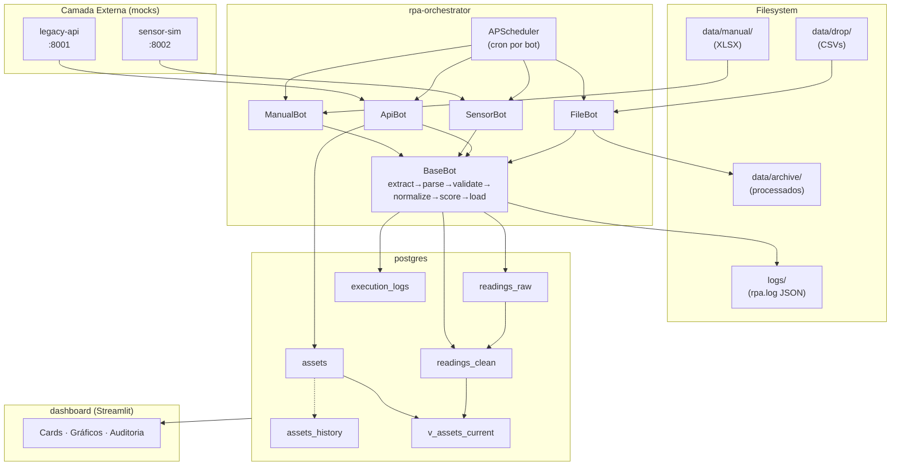

# Arquitetura

## 1. Visão geral

A solução implementa um **pipeline de ingestão multi-fonte** seguindo o padrão
**Bronze → Silver** de arquitetura de dados (Lakehouse):

- **Bronze** (`readings_raw`): payload original, imutável, idempotente.
- **Silver** (`readings_clean`): dados normalizados em SI, validados, com flags e score.

O sistema é composto por **5 serviços containerizados** orquestrados via Docker
Compose. Cada serviço tem responsabilidade única (princípio SRP):

| Serviço             | Imagem               | Responsabilidade |
|---------------------|----------------------|------------------|
| `postgres`          | postgres:16-alpine   | persistência relacional |
| `legacy-api`        | custom (FastAPI)     | mock do sistema legado |
| `sensor-sim`        | custom (FastAPI)     | mock de sensor IoT |
| `rpa-orchestrator`  | custom (Python)      | scheduler + 4 bots RPA |
| `dashboard`         | custom (Streamlit)   | visualização |

## 2. Diagrama de componentes

## 3. Padrões aplicados

### 3.1. Template-method (BaseBot)
Toda a lógica comum do ciclo RPA vive em `BaseBot.run()`:

1. cria `run_id` (UUID)
2. registra início em `execution_logs`
3. chama `extract()` da subclasse → itera registros
4. para cada registro: `parse()` → `_process_record()` (raw → norm → validate → load)
5. captura erros isoladamente (1 linha ruim ≠ batch ruim)
6. registra final (`SUCCESS` / `PARTIAL` / `FAILED`)

→ Adicionar uma quinta fonte é apenas implementar `extract()` e `parse()`.
   Toda a infra de logs, transações, métricas é herdada.

### 3.2. Repository pattern (Repository)
Toda interação SQL passa por `src/db/repository.py`. Vantagens:

- Bots **não conhecem SQL** — só conhecem Pydantic models.
- Trocar Postgres → outra base = mudar 1 arquivo.
- Cada método encapsula sua transação (commit explícito).

### 3.3. Idempotência multinível
| Camada                  | Mecanismo                                       |
|-------------------------|-------------------------------------------------|
| `readings_raw`          | `UNIQUE(source, source_id)` + `INSERT ON CONFLICT DO NOTHING` |
| `readings_clean`        | `UNIQUE(raw_id)` (1:1 com raw)                  |
| `assets`                | `UNIQUE(tag)` + lógica UPSERT no Repository      |
| `assets_history` (SCD2) | só insere quando snapshot muda (compara campos) |

→ Re-rodar o mesmo CSV é seguro. Re-puxar a mesma janela da API é seguro.

### 3.4. Camadas de validação
1. **Pydantic schemas** (`src/models/`) na fronteira (depois do `parse`):
   tipos, ranges absurdos, formatos.
2. **Validator** (`src/transform/validator.py`) lógica de domínio:
   campos obrigatórios, ranges operacionais, timestamp futuro.
3. **DB constraints** (CHECKs no schema): última linha de defesa.

Cada camada falha "macio" — flags + score em vez de descarte total — para
preservar dados pra análise de qualidade no Dashboard.

## 4. Fluxo de uma leitura (end-to-end)

Veja [`fluxo-dados.md`](fluxo-dados.md) para detalhamento por etapa.

## 5. Por que essa arquitetura é a certa pra próxima sprint?

A próxima sprint (Digital Twin / análise inteligente) precisa de:

| Necessidade                        | Já entregue aqui                        |
|------------------------------------|------------------------------------------|
| Dados em unidades canônicas        | `readings_clean` em SI                   |
| Histórico contínuo                 | `readings_clean` indexado por (asset, time) |
| Snapshots de cadastro no tempo     | `assets_history` (SCD type 2)            |
| Confiabilidade dos dados           | `quality_score` + `flags`                |
| Auditoria das execuções            | `execution_logs` com `run_id`            |
| Acréscimo de novas fontes          | herdar `BaseBot`                         |

Resumo: o **schema do banco já é o contrato** das próximas sprints — a equipe
do Digital Twin pode começar a consumir `readings_clean` no dia seguinte.
