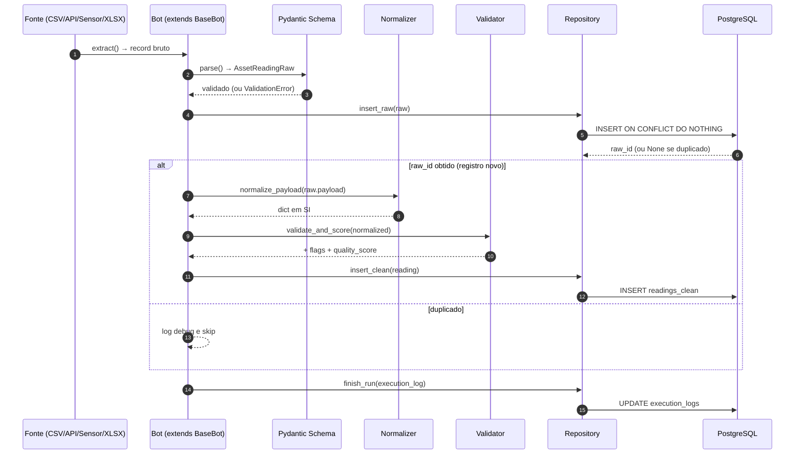
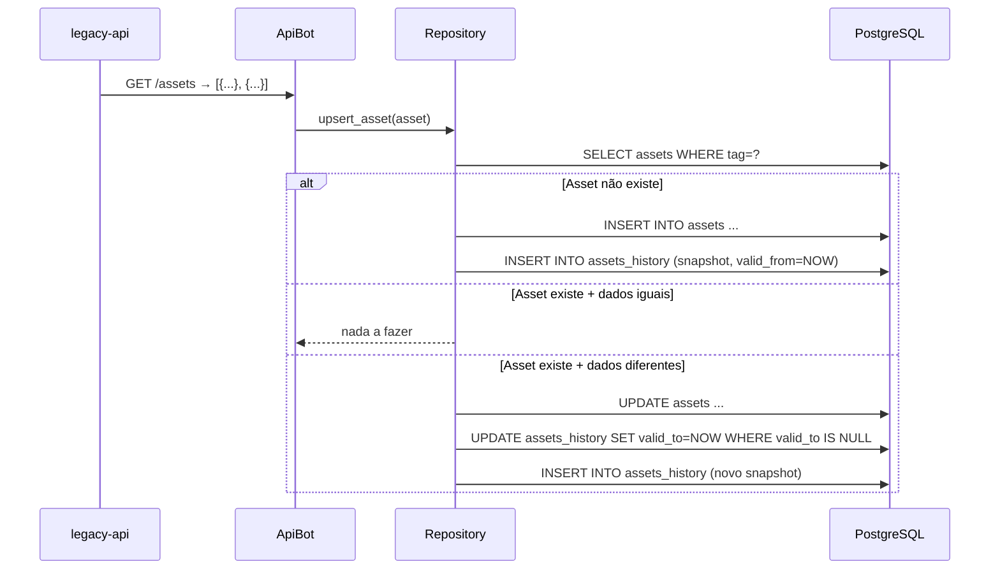

# Fluxo de dados (entrada → processamento → saída)

## Visão sequencial: uma leitura individual



## Etapas detalhadas

### 1. EXTRAÇÃO

| Bot         | Mecanismo                                    | Cron padrão |
|-------------|----------------------------------------------|-------------|
| `file_bot`  | varre `data/drop/*.csv`, lê linhas            | `*/2 * * * *` |
| `api_bot`   | `GET /assets` + `GET /assets/{tag}/readings?since=` | `*/3 * * * *` |
| `sensor_bot`| `GET /readings?since=` + `POST /ack`         | `*/1 * * * *` |
| `manual_bot`| varre `data/manual/*.xlsx`, lê células        | `*/5 * * * *` |

### 2. PARSE → modelo Pydantic
Cada bot constrói um `AssetReadingRaw`:

```python
AssetReadingRaw(
    asset_tag: "MTR-001",
    source: "sensor_iot",
    source_id: "sensor:sim-0000123",   # idempotência
    payload: {...},                    # dict original
    received_at: now(UTC),
    run_id: <uuid da execução>
)
```

Falha de validação (tag inválida, payload vazio, etc) é capturada como warning,
incrementa `records_failed`, mas não derruba o batch.

### 3. PERSISTÊNCIA RAW (idempotente)
```sql
INSERT INTO readings_raw (...)
VALUES (...)
ON CONFLICT (source, source_id) DO NOTHING
RETURNING id;
```
Se já existe (re-execução do mesmo arquivo, replay da API): retorna `NULL`,
o bot pula a normalização (a versão "clean" também já existe).

### 4. NORMALIZAÇÃO → SI
`src/transform/normalizer.py` faz a conversão por campo:

| Campo              | Aceita                            | Saída     |
|--------------------|-----------------------------------|-----------|
| temperature        | °C, °F, K                          | **°C**    |
| voltage            | V, kV, mV                          | **V**     |
| current            | A, mA                              | **A**     |
| power              | kW, W, hp, MW                      | **kW**    |
| vibration          | mm/s, m/s, in/s                    | **mm/s**  |
| timestamp          | ISO8601, epoch (s ou ms), datetime | **datetime UTC** |

Erros de conversão (unidade desconhecida) **não derrubam** o registro — vão pro
`flags["errors"]` e penalizam o `quality_score`.

### 5. VALIDAÇÃO + SCORING
`src/transform/validator.py`:

- **Required**: `measured_at` ausente → `flags["missing"]`
- **Range checks**: cada métrica tem faixa operacional típica de motor
  industrial. Fora da faixa → `flags["out_of_range"]` (mantém o valor).
- **Timestamp futuro** (relógio descalibrado) → `flags["errors"]`
- **Score**: começa em 1.0, desconta penalidades, clamp em [0, 1].

```
score = 1.0 - (0.3 × #missing) - (0.1 × #out_of_range) - (0.2 × #errors)
```

A escolha por **manter dados ruins com score baixo** (vs descartar) preserva
material pra detectar drift de sensor em análises futuras.

### 6. PERSISTÊNCIA CLEAN
```sql
INSERT INTO readings_clean (raw_id, asset_id, asset_tag, measured_at,
                            temperature_c, vibration_mm_s, current_a,
                            voltage_v, rpm, power_kw, quality_score, flags)
VALUES (...)
ON CONFLICT (raw_id) DO NOTHING;
```

`asset_id` é resolvido via `assets.tag` — se a tag chegar antes do cadastro,
fica como `NULL` e pode ser **re-vinculada** depois com:

```sql
UPDATE readings_clean rc SET asset_id = a.id
FROM assets a WHERE rc.asset_tag = a.tag AND rc.asset_id IS NULL;
```

(Não criamos rotina automática pra isso pra MVP — fica registrado.)

### 7. AUDITORIA — execution_logs

Toda execução de bot vira **uma linha** em `execution_logs`:

```
run_id        UUID  da execução
bot_name      file_bot | api_bot | sensor_bot | manual_bot
started_at, finished_at, duration_ms
status        RUNNING → SUCCESS | PARTIAL | FAILED
records_in, records_ok, records_failed
error_message, metadata (JSONB)
```

→ Permite responder questões tipo:
- "Quantas vezes o sensor_bot falhou nas últimas 24h?"
- "Qual a taxa de qualidade dos dados que entram via planilha?"
- "Quem (qual bot) inseriu este `raw_id`?" (`readings_raw.run_id` casa com `execution_logs.run_id`)

## Fluxo de cadastro (assets vs assets_history — SCD type 2)



→ Histórico completo do cadastro é navegável por intervalo `[valid_from, valid_to)`.
